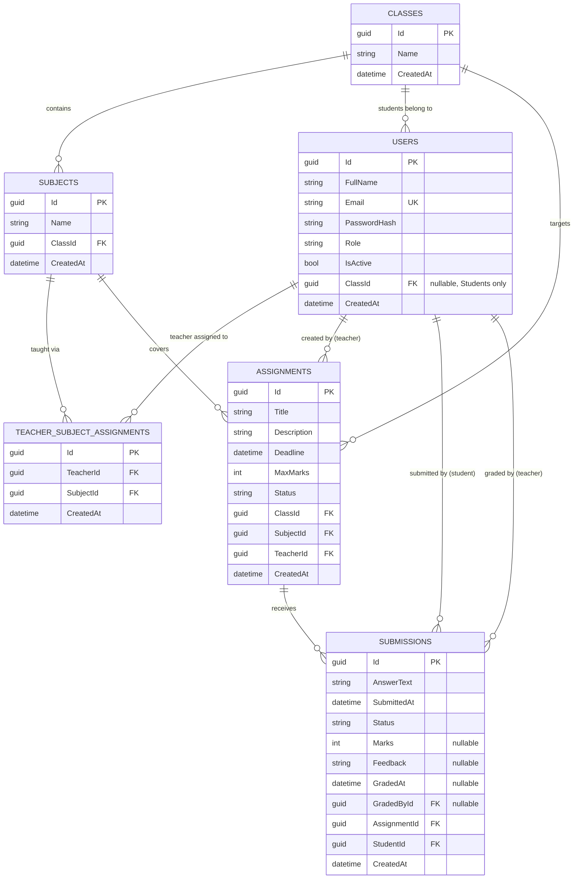

# Assignment & Submission Management System

A role-based (Admin / Teacher / Student) assignment and submission management system for a school or college.

Teachers create assignments for a class and subject, publish them when ready, and grade student submissions. Students see assignments published to their own class, submit answers before the deadline, and view their marks and feedback once graded. Admins manage users, classes, subjects, and which teachers are assigned to which subjects.

## Main Features

**Admin**
- Create and manage Admin, Teacher, and Student accounts; deactivate/reactivate accounts (no hard delete, to preserve history).
- Manage classes and the subjects taught within each class.
- Assign teachers to the subjects they're allowed to teach.
- Read-only visibility into all assignments and submissions across the system.

**Teacher**
- Create, update, delete, and publish/unpublish assignments for a class and subject they're assigned to teach.
- View submissions for their own assignments.
- Grade submissions with marks (validated against the assignment's max marks) and written feedback.
- Change a submission's status (e.g. flag one as `Returned`).

**Student**
- View assignments published to their own class only (drafts and other classes' assignments are never visible).
- Submit an answer before the deadline; update (resubmit) before the deadline, which clears any prior grade since the graded content no longer matches.
- View submission status, marks, and teacher feedback once graded.

**Cross-cutting**
- JWT-based authentication with role-based authorization enforced entirely server-side (Clean Architecture: role/ownership checks live in the Application layer's command/query handlers, not just `[Authorize]` attributes).
- Swagger/OpenAPI with a working "Authorize" button for trying endpoints with a real JWT.
- Structured logging (Serilog) and centralized exception-to-HTTP-status mapping middleware.

## Technology Stack

| Layer | Technology |
|---|---|
| Frontend | Next.js 16 (App Router), React 19, TypeScript, Tailwind CSS, `react-hook-form` + `zod` |
| Backend | ASP.NET Core Web API (.NET 10), C#, Clean Architecture (Domain / Application / Infrastructure / WebApi) |
| Database | PostgreSQL, via EF Core (Npgsql provider), code-first migrations |
| Auth | JWT bearer tokens, role-based authorization |
| Testing | xUnit, FluentAssertions, Moq, EF Core InMemory provider |

## Project Structure

```
/
├── docker-compose.yml       # Postgres only — backend/frontend run natively
├── .env.example             # Postgres credentials for docker-compose
├── server/                  # ASP.NET Core backend (Clean Architecture)
│   ├── AssignmentSubmissionSystem.slnx
│   ├── .env.example          # Backend connection string + JWT secret
│   ├── src/
│   │   ├── Domain/            # Entities, enums, domain exceptions — zero dependencies
│   │   ├── Application/       # Use cases (custom CQRS mediator), DTOs, validators, interfaces
│   │   ├── Infrastructure/    # EF Core, Postgres, JWT/identity, DI wiring
│   │   └── WebApi/            # Controllers, middleware, Program.cs, Swagger
│   └── tests/
│       └── Application.UnitTests/   # Business rules, authorization, submission workflow
└── client/                  # Next.js frontend
    ├── .env.example
    └── src/
        ├── app/               # Route pages: /login, /admin/*, /teacher/*, /student/*
        ├── contexts/          # AuthContext (login/logout, current user)
        ├── lib/               # Typed API client, useApiQuery hook, cookie/date helpers
        ├── proxy.ts           # Route-guarding (Next.js 16's replacement for middleware.ts)
        └── types/             # TypeScript mirrors of backend DTOs
```

### Why Clean Architecture (backend)

Dependency rule: `Domain` has no project references at all. `Application` depends only on `Domain`. `Infrastructure` implements `Application`'s interfaces (`IApplicationDbContext`, `IPasswordHasher`, `IJwtTokenGenerator`, `ICurrentUserService`) and depends on both. `WebApi` wires everything together but contains no business logic — controllers only translate HTTP requests into commands/queries and dispatch them.

The mediator (`Application/Common/Messaging/`) is a small, self-written ~6-file implementation rather than the MediatR package — MediatR's license changed starting at v13 (only v12.x remains free), and `dotnet add package` resolves latest by default, which would have pulled an unlicensed version into a public recruitment submission.

## Database Schema



**Notes on the model:**
- `Users` is a single table for all three roles (`Role` discriminator), rather than three separate tables — login/auth is identical across roles, and `ClassId` is only ever populated for Students.
- `Subjects` are scoped to one `Class` each (not a shared catalog) — see [Assumptions](#assumptions).
- `TeacherSubjectAssignments` is the join table that makes "Admin assigns teachers to subjects" real: a `Teacher` can only create `Assignments` for a `Subject` they have a row here for. A unique index on `(TeacherId, SubjectId)` prevents duplicate assignments.
- `Submissions` has a unique index on `(AssignmentId, StudentId)` — one submission row per student per assignment; resubmitting updates the existing row rather than inserting a new one.
- Every foreign key uses `Restrict` delete behavior (no cascading deletes) — deleting a `Class`/`Subject`/`Assignment` that still has dependents fails with a constraint error rather than silently wiping related data.

## Setup Instructions

### Prerequisites
- [.NET 10 SDK](https://dotnet.microsoft.com/download)
- [Node.js 20+](https://nodejs.org/) and npm
- [Docker Desktop](https://www.docker.com/products/docker-desktop/) (for PostgreSQL)

### 1. Database (PostgreSQL via Docker)

From the **repo root**:

```powershell
cp .env.example .env
```

Edit `.env` and fill in real values (any values work locally, e.g.):
```dotenv
POSTGRES_DB=assignment_submission_db
POSTGRES_USER=admin
POSTGRES_PASSWORD=admin
POSTGRES_PORT=5432
```

Then start Postgres:
```powershell
docker compose up -d
```

### 2. Backend (ASP.NET Core API)

From `server/`:

```powershell
cp .env.example .env
```

Edit `server/.env` — set `ConnectionStrings__DefaultConnection` to match the Postgres credentials from step 1, and generate a real `Jwt__Secret` (any sufficiently long random string; HMAC-SHA256 needs a reasonably long key):

```powershell
-join ((48..57) + (65..90) + (97..122) | Get-Random -Count 64 | ForEach-Object {[char]$_})
```

Paste the output as the value of `Jwt__Secret` in `server/.env`.

Restore, apply migrations, and run:
```powershell
dotnet restore
dotnet ef database update --project src/Infrastructure/Infrastructure.csproj --startup-project src/WebApi/WebApi.csproj
dotnet run --project src/WebApi/WebApi.csproj
```

The API starts at `http://localhost:5064` (see `src/WebApi/Properties/launchSettings.json` for the exact port). Demo data seeds automatically on first run in the Development environment. Swagger UI is at `http://localhost:5064/swagger` — use the **Authorize** button with a token from `POST /api/auth/login` to try authenticated endpoints.

### 3. Frontend (Next.js)

From `client/`:
```powershell
cp .env.example .env.local
npm install
npm run dev
```

Open `http://localhost:3000` — it redirects to `/login`.

## Running Tests

From `server/`:
```powershell
dotnet test tests/Application.UnitTests/Application.UnitTests.csproj
```

Covers: login security (wrong password / inactive user rejection), assignment ownership authorization, the three-way role-based visibility scoping on assignment/submission queries (Admin sees all, Teacher sees only their own, Student sees only published assignments in their own class), and the full submission workflow (deadline enforcement, draft-assignment invisibility, class-membership checks, resubmission clearing a prior grade, and marks-within-range grading validation).

## Demo Credentials

| Role | Email | Password |
|---|---|---|
| Admin | `admin@example.com` | `Admin@123` |
| Teacher | `teacher1@example.com` | `Teacher@123` |
| Teacher | `teacher2@example.com` | `Teacher@123` |
| Student | `student1@example.com` | `Student@123` |
| Student | `student2@example.com` | `Student@123` |
| Student | `student3@example.com` | `Student@123` |

Seeded data also includes 2 classes, 3 subjects, teacher-subject assignments, and a few assignments in a mix of Draft/Published status with sample submissions — enough to explore every role's views without manual setup.

## Assumptions

- A Student belongs to exactly one Class at a time (a simple school model, not multi-course enrollment).
- Subjects are scoped per-Class rather than a shared global catalog across the school.
- A Teacher must be explicitly assigned (by an Admin) to a Subject before they can create Assignments for it.
- A Student may resubmit their answer any time before the deadline; resubmission overwrites the previous answer and clears any existing grade, since the graded content no longer matches what's on record.
- A User's Role is immutable after creation, and Users are never hard-deleted — only deactivated/reactivated — to preserve referential integrity with existing Assignments/Submissions.
- Once created, a Subject cannot be moved to a different Class (only renamed) — reassigning would ripple into existing TeacherSubjectAssignments and Assignments referencing it.
- `SubmissionStatus.Returned` lets a Teacher flag a submission as needing attention but does not reopen the Student's edit window past the deadline.

## Known Limitations

- **No refresh-token flow.** JWTs expire after a fixed lifetime (default 60 minutes, configurable via `Jwt__ExpiryMinutes`); the user must log in again rather than the session silently renewing.
- **No password reset/change flow** for any role after account creation.
- **No cascading delete.** Deleting a Class/Subject/Assignment that still has dependent records (students, subjects, submissions) fails with a database constraint error rather than cascading — dependents must be removed first. This is a deliberate safety choice, not an oversight.
- **No file/attachment upload** — submission answers are plain text only.
- **Automated tests are at the Application layer**, not a separate HTTP-level integration test project — the authorization logic under test lives in the Application handlers regardless of which layer calls it, so these tests exercise the real logic; HTTP-level behavior (JWT validation, `[Authorize]` attributes, status codes) was verified manually via Swagger and direct API calls throughout development instead of a dedicated `WebApplicationFactory` test suite.
- **No pagination or advanced filtering** on list endpoints (listed as optional in the assignment brief).
- The frontend's `proxy.ts` route-guarding (redirecting unauthenticated/wrong-role users away from `/admin`, `/teacher`, `/student`) is a **UX convenience only** — it reads a client-visible `role` cookie, which isn't tamper-proof. The actual authorization boundary is entirely server-side, via `[Authorize(Roles=...)]` and handler-level ownership checks in the Application layer, all covered by the automated tests above.
